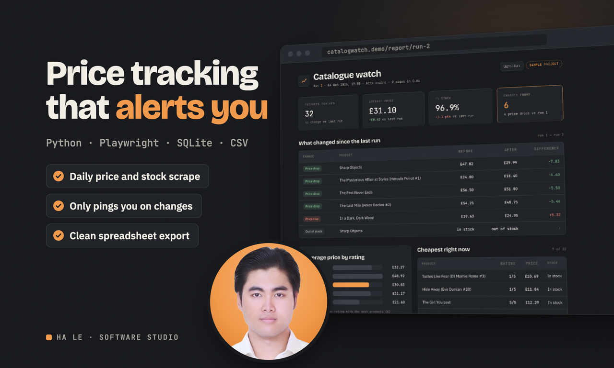
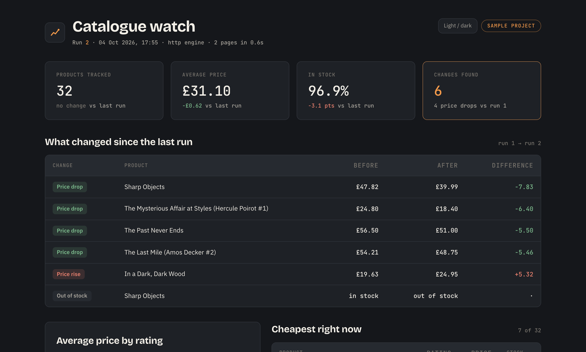
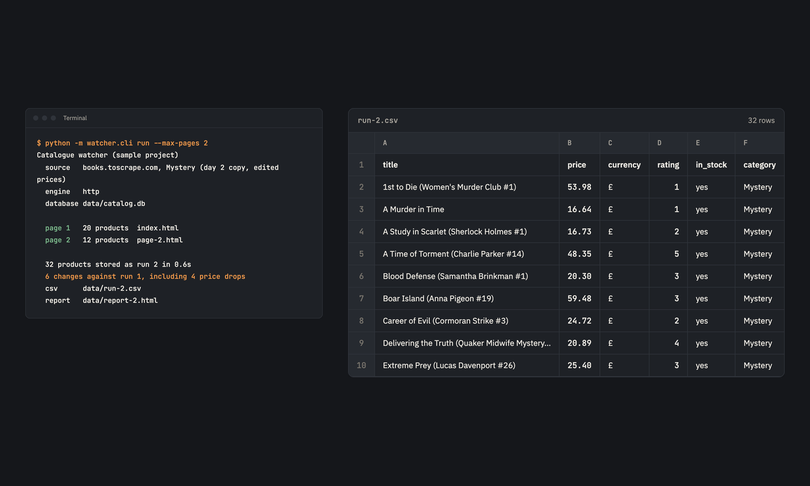

# Catalogue watcher (sample project)

A scraper that turns a product catalogue into a spreadsheet, keeps every run in SQLite, and tells you what changed since last time. Put it on a daily schedule and it stays quiet until a price moves or something goes out of stock. The sample target is books.toscrape.com, a store published specifically for scraping practice.

It ships with two engines. The `http` engine is fast and suits server rendered pages. The `browser` engine drives headless Chromium through Playwright for pages where prices only appear after JavaScript runs. Both produce the same rows, so the storage, CSV export and report never change.

## Run it

```bash
python3 -m venv .venv && source .venv/bin/activate
pip install -r requirements.txt
python3 -m watcher.cli run                 # crawl, store, export CSV, build the HTML report
python3 -m watcher.cli report --run 2      # rebuild the report for any stored run (--theme light)
python3 -m watcher.cli history             # list previous runs
python3 -m pytest tests -q                 # 9 tests
```

Each run writes `data/run-N.csv` and `data/report-N.html` and compares itself against the run before it. The report is a single HTML file with fonts embedded and no outside requests: four KPI cards with the change since the last run, the table of what changed, average price by rating, and the cheapest items, in a dark and a light theme. A sample is in `docs/sample-report.html`.

To run it every morning at 7, add one line with `crontab -e`:

```
0 7 * * * cd /path/to/catalog-watcher && .venv/bin/python -m watcher.cli run --max-pages 3
```

## Seeing the change report with real differences

The practice store never changes its prices, so a second run finds nothing. `fixtures/fetch.sh` mirrors two catalogue pages locally and `fixtures/make_second_day.py` edits four prices and one availability line in that local copy only. Serve the folder with `python3 -m http.server 8099`, point a run at it, and the comparison has something real to find.

| Option | Meaning |
| --- | --- |
| `--source` | First listing page to crawl |
| `--engine` | `http` or `browser` |
| `--max-pages` | How far to follow the next page link |
| `--delay` | Seconds between page requests, keep it polite |
| `--db`, `--out-dir` | Where the database, CSV and report go |
| `--source-label` | Friendly source name shown in the log and report |
| `--theme` | `dark` (default) or `light` report |

`npm install && npm run gallery` regenerates the screenshots in `docs/` from real runs with Playwright.





Built by Ha Le as a portfolio sample. No client data is used anywhere in this repository.
