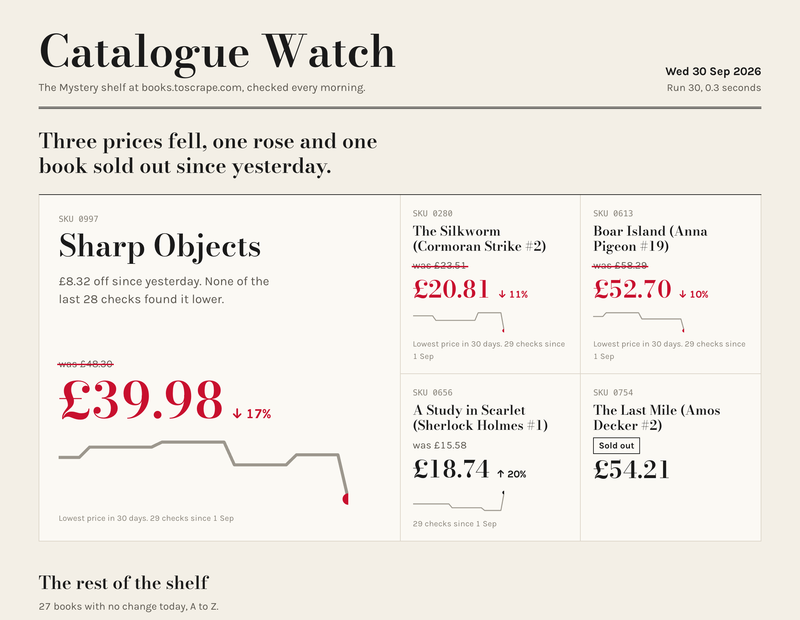
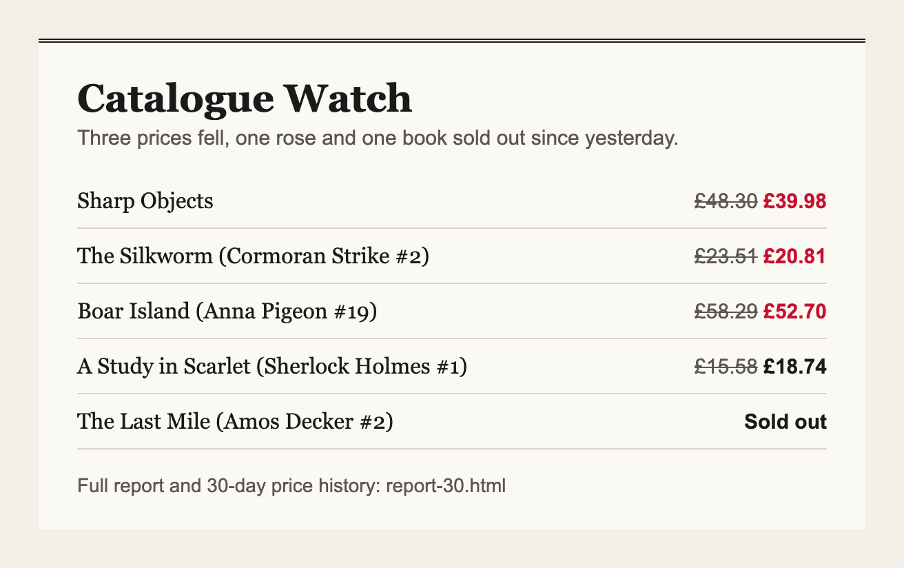
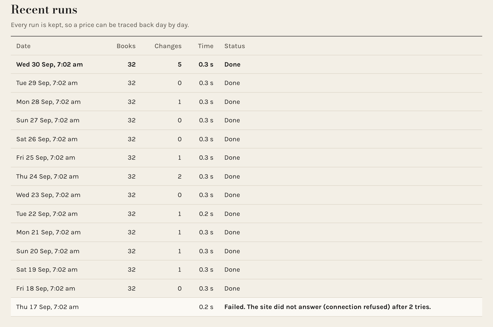
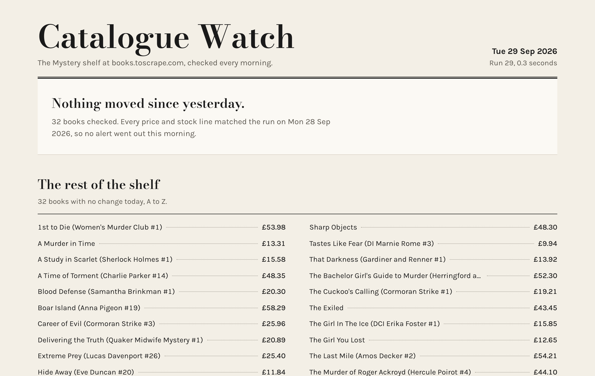

# Catalogue Watch (sample project)

A watcher that checks a shop's shelf every morning, keeps every run in SQLite, and writes a one-page catalog of what changed. The biggest price drop gets the biggest tile, with the old price struck through and 30 days of price history under it. When something moved, one short email goes out. When nothing moved, the page says so and no email is sent. The sample target is books.toscrape.com, a store published for scraping practice.

It ships with two engines. The `http` engine is fast and suits server rendered pages. The `browser` engine drives headless Chromium through Playwright for pages where prices only appear after JavaScript runs. Both produce the same rows, so storage, the CSV and the report never change.



## Run it

```bash
python3 -m venv .venv && source .venv/bin/activate
pip install -r requirements.txt
python3 -m watcher.cli run                 # crawl, store, CSV, report, alert
python3 -m watcher.cli report --run 30     # rebuild the report for any stored run
python3 -m watcher.cli history             # list previous runs, failures included
python3 -m pytest tests -q                 # 13 tests
```

Each run writes `data/run-N.csv` and `data/report-N.html`, compares itself with the last good run, and writes `data/alerts/run-N.html` and `.txt` only when something changed. The report is a single HTML file with its fonts embedded and no outside requests. A sample is in `docs/sample-report.html`.

To send the alert by email, set `WATCHER_SMTP_HOST`, `WATCHER_SMTP_PORT`, `WATCHER_SMTP_USER`, `WATCHER_SMTP_PASSWORD`, `WATCHER_ALERT_FROM` and `WATCHER_ALERT_TO`. Without them the email is only written to disk.

If the site does not answer, the run retries (`--retries`, default 2). If it still fails, the run is recorded as failed, the report says so and shows the last good prices, and nothing is overwritten.

To run it every morning at 7, add one line with `crontab -e`:

```
0 7 * * * cd /path/to/catalog-watcher && .venv/bin/python -m watcher.cli run --max-pages 3
```

| Option | Meaning |
| --- | --- |
| `--source` | First listing page to crawl |
| `--engine` | `http` or `browser` |
| `--max-pages` | How far to follow the next page link |
| `--delay` | Seconds between page requests, keep it polite |
| `--retries`, `--retry-wait` | Extra attempts before a run is recorded as failed |
| `--db`, `--out-dir` | Where the database, CSV, report and alerts go |
| `--source-label` | Friendly source name shown in the log and report |
| `--as-of` | Run date to record, for backfills |

## Thirty days of history from a store that never changes

The practice store never changes its prices, so a watcher pointed at it would never find anything. `fixtures/fetch.sh` saves the two Mystery pages into `fixtures/original/`, and `fixtures/make_history.py` builds 30 daily copies with price moves a real shop makes: small drifts, markdowns, a price rise and one book selling out. Each copy is served locally and crawled by the real watcher with a back-dated run date. Day 1 crawls the live site. On day 17 the local "site" is switched off, so the history also shows a failed run.

```bash
python fixtures/make_history.py            # about 10 seconds, writes data/
python scripts/timings.py                  # times each stage, writes data/timings.json
npm install && node scripts/gallery.js docs/raw docs/raw   # screenshots from the real reports
```





Fonts: Bodoni Moda and Karla, both under the SIL Open Font License (`watcher/assets/fonts/LICENSE.txt`).

Built by Ha Le as a portfolio sample. No client data is used anywhere in this repository.
